# DIMS  


🐟 数据库系统原理课程设计，Drug Inventory Management System，基于 SSM 框架的基于SSM的药店销售管理系统。  

## 任务进度  

- [X] [0. 本组成员任务分工](#本组成员任务分工)  
- [X] [1. 数据库设计](#数据库设计)  
    - [X] [1.1 需求分析](#需求分析)  
        - [X] [1.1.1 业务用例图](#业务用例图)  
        - [X] [1.1.2 数据字典](#数据字典)  
    - [X] [1.2 概念结构设计](#概念结构设计)  
        - [X] [1.2.1 E-R 图](#E-R-图)  
    - [X] [1.3 逻辑结构设计](#逻辑结构设计)  
        - [X] [1.3.1 E-R 图向关系模型的转换](#E-R-图向关系模型的转换)  
        - [X] [1.3.2 数据模型的优化](#数据模型的优化)  
        - [X] [1.3.3 设计用户子模式](#设计用户子模式)  
    - [X] [1.4 物理结构设计](#物理结构设计)  
        - [X] [1.4.1 关系模式存取方法选择](#关系模式存取方法选择)  
    - [X] [1.5 数据库实施](#数据库实施)  
        - [X] [1.5.1 建立数据库](#建立数据库)  
        - [X] [1.5.2 建立基本表](#建立基本表)  
        - [X] [1.5.3 建立视图](#建立视图)  
        - [X] [1.5.4 建立存储过程](#建立存储过程)  
    - [X] [1.6 数据库运行和维护](#数据库运行和维护)  
- [X] [2. 应用系统设计](#应用系统设计)  
    - [X] [2.0 技术选型](#技术选型)  
    - [X] [2.1 详细设计](#详细设计)  
        - [X] [2.1.1 页面流程图](#页面流程图)  
            - [X] [2.1.1.1 用户页面流程图](#用户页面流程图)  
            - [X] [2.1.1.2 库存管理员页面流程图](#库存管理员页面流程图)  
            - [X] [2.1.1.3 医生页面流程图](#医生页面流程图)  
            - [X] [2.1.1.4 护士页面流程图](#护士页面流程图)  
    - [X] [2.2 环境准备](#环境准备)  
        - [X] [2.2.1 配置 Java 环境](#配置-Java-环境)  
        - [X] [2.2.2 安装 Eclipse IDE for Enterprise Java Developers](#安装-Eclipse-IDE-for-Enterprise-Java-Developers)  
        - [X] [2.2.3 配置 Tomcat 环境](#配置-Tomcat-环境)  
        - [X] [2.2.4 在 Eclipse 中配置 Tomcat Server](#在-Eclipse-中配置-Tomcat-Server)  
    - [X] [2.3 创建一个新的 Dynamic Web 项目](#创建一个新的-Dynamic-Web-项目)  
    - [X] [2.4 集成 Spring 和 SpingMVC](#集成-Spring-和-SpingMVC)  
        - [X] [2.4.1 导入 Spring 的 jar 包](#导入-Spring-的-jar-包)  
        - [X] [2.4.2 导入 SpringMVC 的 jar 包](#导入-SpringMVC-的-jar-包)  
        - [X] [2.4.3 导入 Apache Commons 的 jar 包](#导入-Apache-Commons-的-jar-包)  
        - [X] [2.4.4 导入其它基础 jar 包](#导入其它基础-jar-包)  
        - [X] [2.4.5 配置 Spring](#配置-Spring)  
        - [X] [2.4.6 配置 SpringMVC](#配置-SpringMVC)  
    - [X] [2.5 配置 web.xml](#配置-web.xml)  
    - [X] [2.6 集成 Spring 和 MyBatis](#集成-Spring-和-MyBatis)  
        - [X] [2.6.1 导入 MyBatis 的 jar 包](#导入-MyBatis-的-jar-包)  
        - [X] [2.6.2 配置 MyBatis](#配置-MyBatis)  
    - [X] [2.7 配置 log4j](#配置-log4j)  
    - [X] [2.8 集成基于 Bootstrap 前端框架的 ACE 管理系统页面模板](#集成基于-Bootstrap-前端框架的-ACE-管理系统页面模板)  
    - [X] [2.9 导入 Apache Taglibs 的 jar 包](#导入-Apache-Taglibs-的-jar-包)  
- [X] [3. 测试与验收](#测试与验收)  
    - [X] [3.1 界面测试](#界面测试)  
    - [X] [3.2 功能测试](#功能测试)  
    - [X] [3.3 性能测试](#性能测试)  
    - [X] [3.4 需求测试](#需求测试)  
- [X] [4. 遇到的问题](#遇到的问题)  
- [X] [5. 成果截图](#成果截图)  

## 本组成员任务分工  

* 需求分析：全员  
* 概念结构设计：全员  
* 逻辑结构设计：全员  
* 物理结构设计：全员  
* 数据库实施：全员  
* 数据库运行和维护：全员  
* 应用系统设计：[tys1998](https://github.com/tys1998)  
* 测试与验收：[RID0517](https://github.com/RID0517)、[Chingki](https://github.com/Chingki)、[ice-che](https://github.com/ice-che)  
* 编写文档：[RID0517](https://github.com/RID0517)、[ice-che](https://github.com/ice-che)  
* 编写答辩 PPT：[unique717171](https://github.com/unique717171)  

## 数据库设计  

**数据库应用系统**：使用数据库的各类信息系统。  

**广义的数据库设计**：数据库及其应用系统的设计，即整个数据库应用系统。  

**狭义的数据库设计**：设计数据库本身，即设计数据库的各级模式并建立数据库。  

设计一个好的数据库与设计一个好的数据库应用系统是密不可分的，一个好的数据库结构是应用系统的基础，特别在实际的系统开发项目中两者更是密切相关、并行进行的。  

**数据库设计 (database design) 的一般定义**：数据库设计是指对于一个给定的应用环境，构造 (设计) 优化的数据库逻辑模式和物理结构，并据此建立数据库及其应用系统，使之能够有效地存储和管理数据，满足各种用户的应用需求，包括信息管理要求和数据操作要求。  

信息管理要求是指在数据库中应该存储和管理哪些数据对象；数据操作要求是指对数据对象需要进行哪些操作，如查询、增、删、改、统计等操作。  

**数据库设计的目标**：为用户和各种应用系统提供一个信息基础设施和高效的运行环境。  

高效的运行环境指数据库数据的存取效率、数据库存储空间的利用率、数据库系统运行管理的效率等都是最高的。  

在数据库设计过程中，需求分析和概念结构设计可以独立于任何数据库管理系统进行，逻辑结构设计和物理结构设计与选用的数据库管理系统密切相关。  

根据结构化系统设计的方法，考虑数据库及其应用系统开发全过程，将数据库设计分为以下 6 个阶段：  

* [需求分析](#需求分析)  
* [概念结构设计](#概念结构设计)  
* [逻辑结构设计](#逻辑结构设计)  
* [物理结构设计](#物理结构设计)  
* [数据库实施](#数据库实施)  
* [数据库运行和维护](#数据库运行和维护)  

设计一个完善的数据库应用系统是不可能一蹴而就的，它往往是上述 6 个阶段的不断反复。  

数据库设计过程中的各个阶段关于数据特性的设计描述：  

| 设计阶段 | 设计描述 |
| --- | --- |
| [需求分析](#需求分析) | 数字字典、全系统中数据项、数据结构、数据流、数据存储的描述 |
| [概念结构设计](#概念结构设计) | 概念模型 (E-R 图)、数据字典 |
| [逻辑结构设计](#逻辑结构设计) | 某种数据模型 (关系 / 非关系) |
| [物理结构设计](#物理结构设计) | 存储安排、存取方法选择、存取路径建立 |
| [数据库实施](#数据库实施) | 创建数据库模式、装入数据、数据库试运行 |
| [数据库运行和维护](#数据库运行和维护) | 性能监测、转储 / 恢复、数据库重组和重构 |

数据库设计过程中的各级模式：  

在需求分析阶段综合各个用户的应用需求；在概念结构设计阶段形成独立于机器特点、独立于各个关系数据库管理系统产品的概念模式 (E-R 图)；在逻辑结构设计阶段将 E-R 图转换成具体的数据库产品支持的数据模型，如关系模型，形成数据库逻辑模式，然后根据用户处理的要求、安全性的考虑，在基本表的基础上再建立必要的视图，形成数据的外模式；在物理结构设计阶段，根据关系数据库管理系统的特点和处理的需要进行物理存储安排，建立索引，形成数据库内模式。  

### 需求分析  

需求分析必须准确了解与分析用户需求 (包括数据与处理)。  

**设计描述**：数字字典、全系统中数据项、数据结构、数据流、数据存储的描述。  

**任务**：通过详细调查现实世界要处理的对象 (组织、部门、企业等)，充分了解原系统 (手工系统或计算机系统) 的工作概况，明确用户的各种需求，然后在此基础上确定新系统的功能。新系统必须充分考虑今后可能的扩充和改变，不能仅仅按当前应用需求来设计数据库。调查的重点是 **“数据”** 和 **“处理”**，通过调查、收集与分析，获得用户对数据库的如下要求：  

* **信息要求**：指用户需要从数据库中获得信息的内容与性质。由信息要求可以导出数据要求，即在数据库中需要存储哪些数据。  
* **处理要求**：指用户要完成的数据处理功能，对处理性能的要求。  
* **安全性与完整性要求**  

#### 业务用例图  

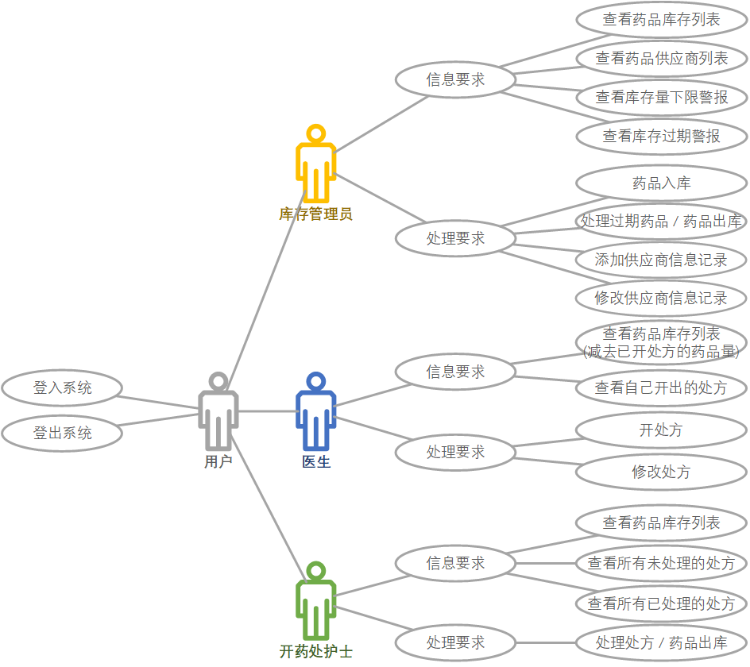  

参考：  

* [UML 之用例图](https://www.cnblogs.com/gd-luojialin/p/10356704.html)  

#### 数据字典  

数据字典是进行详细的数据收集和数据分析所获得的主要成果。它是关于数据库中数据的描述，即元数据，而不是数据本身。数据字典是在需求分析阶段建立，在数据库设计过程中不断修改、充实、完善的。它在数据库设计中占有很重要的地位。数据字典通常包括数据项、数据结构、数据流、数据存储和处理过程几部分。其中数据项是数据的最小组成单位，若干个数据项可以组成一个数据结构。数据字典通过对数据项和数据结构的定义来描述数据流、数据存储的逻辑内容。  

* **数据项**：数据项是不可再分的数据单位。对数据项的描述通常包括以下内容：  

    ```
    数据项描述 = { 数据项名, 数据项含义说明, 别名, 数据类型, 长度, 取值范围, 取值含义, 与其他数据项的逻辑关系, 数据项之间的联系 }
    ```

    | 数据项名 | 数据项含义说明 | 数据类型 | 长度 | 取值范围 | 取值含义 | 与其他数据项的逻辑关系 | 数据项之间的联系 |
    | --- | --- | --- | --- | --- | --- | --- | --- |
    | Ano | 库存管理员编号，唯一标识每个库存管理员 | VARCHAR | 20 |  |  |  |  |
    | Aname | 库存管理员姓名 | VARCHAR | 20 |  |  |  | Ano→Aname |
    | Asex | 库存管理员性别 | BIT | 1 | { 0, 1 } | 0 代表女，1 代表男 |  | Ano→Asex |
    | Aage | 库存管理员年龄 | SMALLINT | 2 | [0, 32767] |  |  | Ano→Aage |
    | Apwd | 库存管理员登陆密码 | VARCHAR | 20 |  |  |  | Ano→Apwd |
    | Dno | 医生编号，唯一标识每个医生 | VARCHAR | 20 |  |  |  |   |
    | Dname | 医生姓名 | VARCHAR | 20 |  |  |  | Dno→Dname |
    | Dsex | 医生性别 | BIT | 1 | { 0, 1 } | 0 代表女，1 代表男 |  | Dno→Dsex |
    | Dage | 医生年龄 | SMALLINT | 2 | [0, 32767] |  |  | Dno→Dage |
    | Dpwd | 医生登陆密码 | VARCHAR | 20 |  |  |  | Dno→Dpwd |
    | Nno | 发药处护士编号，唯一标识每个护士 | VARCHAR | 20 |  |  |  |  |
    | Nname | 发药处护士姓名 | VARCHAR | 20 |  |  |  | Nno→Nname |
    | Nsex | 发药处护士性别 | BIT | 1 | { 0, 1 } | 0 代表女，1 代表男 |  | Nno→Nsex |
    | Nage | 发药处护士年龄 | SMALLINT | 2 | [0, 32767] |  |  | Nno→Nage |
    | Npwd | 发药处护士登陆密码 | VARCHAR | 20 |  |  |  | Nno→Npwd |
    | Sno | 药品供应商编号，唯一标识每个药品供应商 | VARCHAR | 20 |  |  |  |  |
    | Sname | 药品供应商名称 | VARCHAR | 20 |  |  |  | Sno→Sname |
    | Saddr | 药品供应商地址 | VARCHAR | 60 |  |  |  | Sno→Saddr |
    | Sphone | 药品供应商电话 | VARCHAR | 20 |  |  |  | Sno→Sphone |
    | PDno | 药品编号，唯一标识每种药品 | VARCHAR | 20 |  |  |  |  |
    | PDname | 药品名称 | VARCHAR | 20 |  |  |  | PDno→PDname |
    | PDlife | 药品保质期 | SMALLINT | 2 | [0, 32767] |  |  | PDno→PDlife |
    | PDbatch | 药品批次，结合药品编号来唯一标识每批药品 | DATE |  |  |  |  |  |
    | PDnum | 药品数量 | SMALLINT | 2 | [0, 32767] |  |  | (PDno, PDbatch)→PDnum |
    | SAno | 药品入库库存管理员编号 | VARCHAR | 20 |  |  | SAno ∈ List`<Ano`> | (PDno, PDbatch)→SAno |
    | Stime | 药品入库时间 | DATETIME |  |  |  | Stime ≥ PDbatch | (PDno, PDbatch)→Stime |
    | DAno | 药品销毁库存管理员编号 | VARCHAR | 20 |  |  | DAno ∈ List`<Ano`> | (PDno, PDbatch)→DAno |
    | Dtime | 药品销毁时间 | DATETIME |  |  |  | Dtime ≥ Stime | (PDno, PDbatch)→Dtime |
    | Pno | 处方编号，唯一标识每个处方 | INT |  | [1, 2147483647] |  |  |  |
    | Pid | 病人身份证号 | VARCHAR | 20 |  |  |  | Pno→Pid |
    | Ptime | 处方开出时间 | DATETIME |  |  |  |  | Pno→Ptime |
    | Htime | 处方处理时间 | DATETIME |  |  |  | Htime ≥ Ptime | Pno→Htime |
    | Pstate | 处方状态 | BIT | 1 | { 0, 1 } | 0 代表未处理，1 代表已处理 |  | Pno→Pstate |

* **数据结构**：数据结构反映了数据之间的组合关系。一个数据结构可以由若干数据项组成，也可以由若干个数据结构组成，或由若干个数据项和数据结构混合组成。对数据结构的描述通常包括以下内容：  

    ```
    数据结构描述 = { 数据结构名, 含义说明, 组成:{数据项或数据结构} }
    ```

    | 数据结构名 | 含义说明 | 组成:{数据项或数据结构} |
    | --- | --- | --- |
    | Admin | 库存管理员，定义了一个库存管理员的有关信息 | { Ano, Aname, Asex, Aage, Apwd } |
    | Doctor | 医生，定义了一个医生的有关信息 | { Dno, Dname, Dsex, Dage, Dpwd } |
    | Nurse | 发药处护士，定义了一个护士的有关信息 | { Nno, Nname, Nsex, Nage, Npwd } |
    | Supplier | 药品供应商，定义了一个药品供应商的有关信息 | { Sno, Sname, Saddr, Sphone } |
    | Drug | 药品，定义了一种药品的有关信息 | { PDno, PDname, PDlife, PDnum } |
    | InventoryDrug | 库存药品，定义了一批库存药品的有关信息 | { PDno, PDname, PDlife, PDbatch, PDnum, Sno, SAno, Stime } |
    | DestroyedDrug | 已销毁药品，定义了一批已销毁药品的有关信息 | { PDno, PDname, PDlife, PDbatch, PDnum, Sno, SAno, Stime, DAno, Dtime } |
    | Prescription | 处方，定义了一个处方的有关信息 | { Pno, Pid, Dno, Ptime, Nno, Htime, Pstate, List`Drug` } |

* **数据流**：数据流是数据结构在系统内传输的路径。对数据流的描述通常包括以下内容：  

    ```
    数据流描述 = { 数据流名, 说明, 数据流来源, 数据流去向, 组成:{数据结构}, 平均流量, 高峰期流量 }
    ```

    | 数据流名 | 说明 | 数据流来源 | 数据流去向 | 组成:{数据结构} | 平均流量 | 高峰期流量 |
    | --- | --- | ---  | --- | --- | --- | --- |

* **数据存储**：数据存储是数据结构停留或保存的地方，也是数据流的来源和去向之一。它可以是手工文档或手工凭单，也可以是计算机文档。对数据存储的描述通常包括以下内容：  

    ```
    数据存储描述 = { 数据存储名, 说明, 编号, 输入的数据流, 输出的数据流, 组成:{数据结构}, 数据量, 存取频度, 存取方式 }
    ```

    | 数据存储名 | 说明 | 编号 | 输入的数据流 | 输出的数据流 | 组成:{数据结构} | 数据量 | 存取频度 | 存取方式 |
    | --- | --- | --- | --- | --- | --- | --- | --- | --- |

* **处理过程**：处理过程的具体处理逻辑一般用判定表或判定树来描述。数据字典中只需要描述处理过程的说明性信息即可，通常包括以下内容：  

    ```
    处理过程描述 = { 处理过程名, 说明, 输入:{数据流}, 输出:{数据流}, 处理:{简要说明} }
    ```

    | 处理过程名 | 说明 | 输入:{数据流} | 输出:{数据流} | 处理:{简要说明} |
    | --- | --- | --- | --- | --- |

参考：  
* [汽车修配管理信息系统课程设计报告](http://ishare.iask.sina.com.cn/f/1H3ghDKS2Oo4.html)  

### 概念结构设计  

概念结构设计通过对用户需求进行综合、归纳与抽象，形成一个独立于具体数据库管理系统的概念模型。  

**设计描述**：概念模型 (E-R 图)、数据字典。  

**任务**：概念结构设计的第一步就是对需求分析阶段收集到的数据进行分类、组织，确定实体、实体的属性、实体之间的联系类型，形成 E-R 图。  

#### E-R 图  

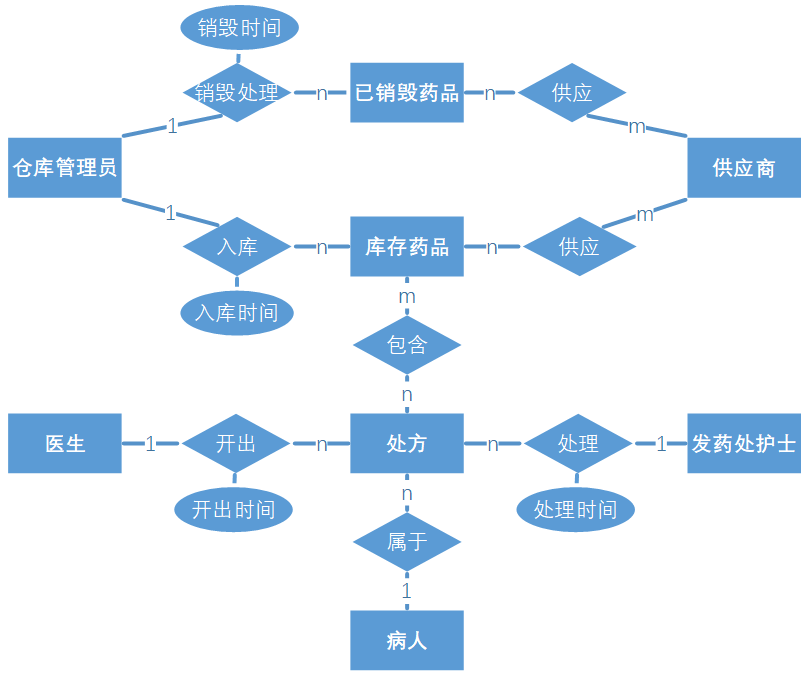  

### 逻辑结构设计  

逻辑结构设计是将概念结构转换为某个数据库管理系统所支持的数据模型，并对其进行优化。  

**设计描述**：某种数据模型 (关系 / 非关系)。  

**任务**：把概念结构设计阶段设计好的基本 E-R 图转换为与选用数据库管理系统产品所支持的数据模型相符合的逻辑结构。将概念模型转换为全局逻辑模型后，还应该根据局部应用需求，结合具体关系数据库管理系统的特点设计用户的外模式。  

#### E-R 图向关系模型的转换  

1. 一个 1:1 联系可以转换为一个独立的关系模式，也可以与任意一端的关系模式合并。  
2. 一个 1:n 联系可以转换为一个独立的关系模式，也可以与 n 端对应的关系模式合并。  
3. 一个 m:n 联系转换为一个关系模式。  
4. 三个或三个以上实体间的一个多元联系可以转换为一个关系模式。  
5. 具有相同码的关系模式可以合并。  

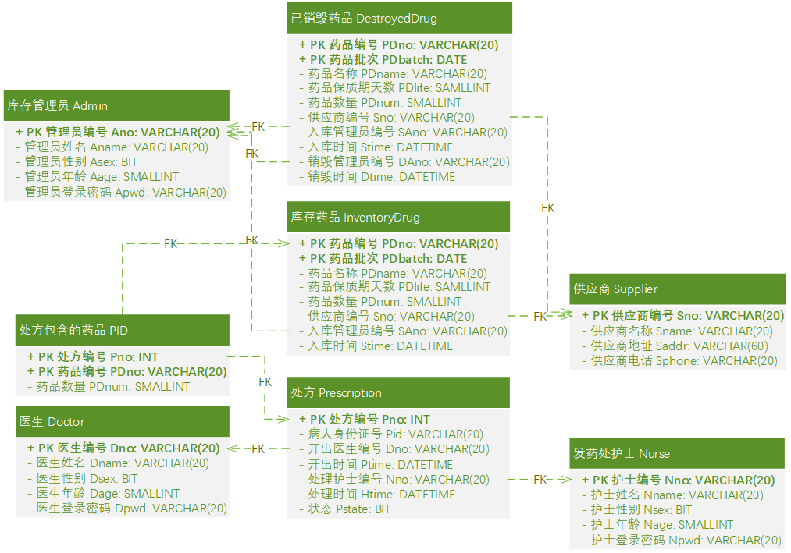  

#### 数据模型的优化  

关系数据模型的优化通常以规范化理论为指导，方法为：  

1. 确定数据依赖。按需求分析阶段所得到的语义，分别写出每个关系模式内部各属性之间的数据依赖以及不同关系模式属性之间的数据依赖。  
2. 对于各个关系模式之间的数据依赖进行极小化处理，消除冗余的联系。  
3. 按照数据依赖的理论对关系模式逐一进行分析，考察是否存在部分函数依赖、传递函数依赖、多值依赖等，确定各关系模式分别属于第几范式。  
4. 根据需求分析阶段得到的处理要求分析对于这样的应用环境这些模式是否合适，确定是否要对某些模式进行合并或分解。必须注意的是，**并不是规范化程度越高的关系就越优**。对于一个具体应用来说，到底规范化到什么程度需要权衡响应时间和潜在问题两者的利弊决定。  
5. 对关系模式进行必要分解，提高数据操作效率和存储空间利用率。常用的两种分解方法是水平分解和垂直分解。  
    * 水平分解：把 (基本) 关系的元组分为若干子集合，定义每个子集为一个子关系，以提高系统的效率。  
    * 垂直分解：把关系模式 R 的属性分解为若干子集合，形成若干子关系模式。垂直分解的原则是，将经常在一起使用的属性从 R 中分解出来形成一个子关系模式。  

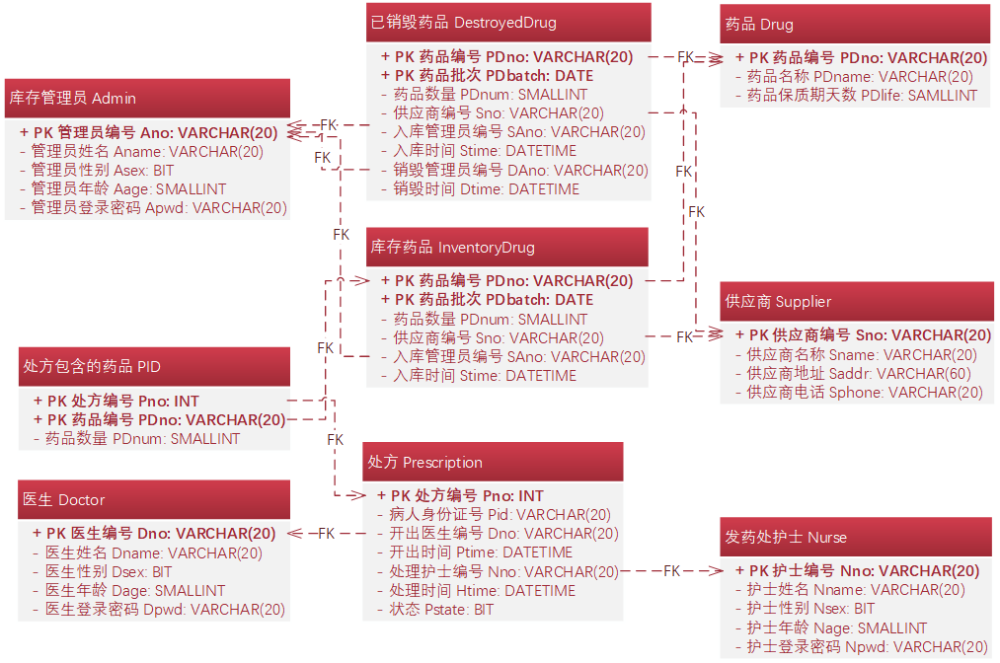  

#### 设计用户子模式  

定义数据库全局模式主要是从系统的时间效率、空间效率、易维护等角度出发。  

定义用户外模式时可以注重考虑用户的习惯与方便，具体包括以下几方面：  

1. 使用更符合用户习惯的别名。在合并各分 E-R 图时曾做过消除命名冲突的工作，以使数据库系统中同一关系和属性具有唯一的名字。这在设计数据库整体结构时是非常必要的。用视图机制可以在设计用户视图时重新定义某些属性名，使其与用户习惯一致，以方便使用。  
2. 可以对不同级别的用户定义不同的视图，以保证系统的安全性。  
3. 简化用户对系统的使用。如果某些局部应用中经常要使用某些很复杂的查询，为了方便用户，可以将这些复杂查询定义为视图，用户每次只对定义好的视图进行查询，大大简化了用户的使用。  

一共设计了 5 个用户子模式 (视图)——`DrugView`、`InventoryDrugView`、`DestroyedDrugView`、`AllPDbatchView`、`DrugDoctorView`，这 5 个视图都是为了简化数据库用户 (主要是应用程序员) 对系统的使用。  

其中 `InventoryDrugView` 和 `DestroyedDrugView` 是对先前做了优化分解的两个关系模式的重新连接；`DrugView` 是对各药品的所有批次进行汇总统计，主要是为了计算各药品的库存总量；`AllPDbatchView` 是对所有药品批次 (包括现存的批次和已销毁的批次) 的合并汇总查询。  

其中比较复杂的是 `DrugDoctorView`，对于应用系统的三类人员来说，库存管理员和发药处护士的视图所看到的药品库存量是一样的，都是真实的药品库存量，只有医生的视图不一样，医生所看到的药品库存量应该是真实的药品库存量减去已开出但未处理的处方当中所包含的药品库存量。  


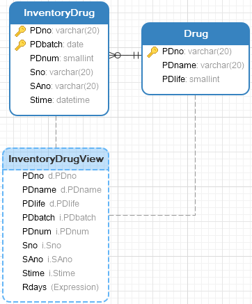  

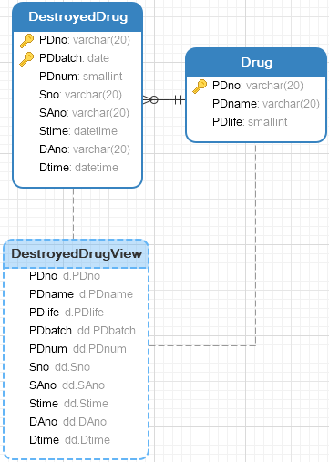  

  

### 物理结构设计  

物理结构设计是为逻辑数据模型选取一个最适合应用环境的物理结构 (包括存储结构和存取方法)。  

**设计描述**：存储安排、存取方法选择、存取路径建立。  

**内容**：主要包括为关系模式选择存取方法，以及设计关系、索引等数据库文件的物理存储结构。  

#### 关系模式存取方法选择  

数据库系统是多用户共享的系统，对同一个关系要建立多条存取路径才能满足多用户的多种应用要求。物理结构设计的任务之一是根据关系数据库管理系统支持的存取方法确定选择哪些存取方法。  

存取方法是快速存取数据库中数据的技术。所谓选择索引存取方法，实际上就是根据应用要求确定对关系的哪些属性列建立索引、哪些属性列建立组合索引、哪些索引要设计为唯一索引等。  

关系上定义的索引数并不是越多越好，系统为维护索引要付出代价，查找索引也要付出代价。例如，若一个关系的更新频率很高，这个关系上定义的索引数不能太多。因为更新一个关系时，必须对这个关系上有关的索引做相应的修改。  

数据库管理系统一般提供多种存取方法。常用的存取方法为 **索引方法** 和 **聚簇 (clustering) 方法**。B+ 树索引和 hash 索引是数据库中经典的存取方法，使用最普遍。  

* B+ 树索引存取方法的选择 (也是一般索引存取方法的选择)：  

    * 如果一个 (或一组) 属性经常在查询条件中出现，则考虑在这个 (或这组) 属性上建立索引 (或组合索引)。  
    * 如果一个属性经常作为最大值和最小值等聚集函数的参数，则考虑在这个属性上建立索引。  
    * 如果一个 (或一组) 属性经常在连接操作的连接条件中出现，则考虑在这个 (或这组) 属性上建立索引。  

* hash 索引存取方法的选择：如果一个关系的属性主要出现在等值连接条件中或主要出现在等值比较选择条件中，而且满足下列两个条件之一，则此关系可以选择 hash 索引存取方法。  

    * 一个关系的大小可预知，而且不变。  
    * 关系的大小动态改变，但数据库管理系统提供了动态 hash 存取方法。  

* 聚簇存取方法的选择：  

    为了提高某个属性 (或属性组) 的查询速度，把这个或这些属性上具有相同值的元组集中存放在连续的物理块中称为聚簇。该属性 (或属性组) 称为 **聚簇码 (cluster key)**。聚簇功能可以大大提高按聚簇码进行查询的效率。  

    聚簇功能不但适用于单个关系，也适用于经常进行连接操作的多个关系。即把多个连接关系的元组按连接属性值聚集存放。这就相当于把多个关系按“预连接”的形式存放，从而大大提高连接操作的效率。  

    一个数据库可以建立多个聚簇，一个关系只能加入一个聚簇。选择聚簇存取方法，即确定需要建立多少个聚簇，每个聚簇中包括哪些关系。  

    1. 首先设计候选聚簇，一般来说：  

        * 对经常在一起进行连接操作的关系可以建立聚簇。  
        * 如果一个关系的一组属性经常出现在相等比较条件中，则该单个关系可建立聚簇。  
        * 如果一个关系的一个 (或一组) 属性上的值重复率很高，则此单个关系可建立聚簇。即对应每个聚簇码值的平均元组数不能太少，太少则聚簇的效果不明显。  

    2. 然后检查候选聚簇中的关系，取消其中不必要的关系。  

        * 从聚簇中删除经常进行全表扫描的关系。  
        * 从聚簇中删除更新操作远多于连接操作的关系。  
        * 不同的聚簇中可能包含相同的关系，一个关系可以在某一个聚簇中，但不能同时加入多个聚簇。要从这多个聚簇方案中 (包括不建立聚簇) 中选择一个较优的，即在这个聚簇上运行各种事务的总代价最小。  

综合考量之后，我们认为不建立索引和聚簇的话运行各种事务的总代价反而最小，所以我们不建立索引和聚簇。  

### 数据库实施  

在数据库实施阶段，设计人员运用数据库管理系统提供的数据库语言及其宿主语言，根据逻辑设计和物理设计的结果建立数据库，编写与调试应用程序，组织数据入库，并进行试运行。  

**设计描述**：创建数据库模式、装入数据、数据库试运行。  

* [preDB.sql](./preDB.sql)  

#### 建立数据库：  

```sql
USE master;

IF EXISTS (SELECT *
            FROM sysdatabases
            WHERE name = 'DIMS')
BEGIN
    DROP DATABASE DIMS;
END;

CREATE DATABASE DIMS;

IF NOT EXISTS (SELECT *
                FROM syslogins
                WHERE name = 'dba')
BEGIN
    CREATE LOGIN dba WITH PASSWORD = 'abcd1234@', DEFAULT_DATABASE = DIMS;
END

GO

USE DIMS;

CREATE USER dba FOR LOGIN dba WITH DEFAULT_SCHEMA = dbo;

EXEC sp_addrolemember 'db_owner', 'dba';
```

#### 建立基本表：  

```sql
CREATE TABLE Admin( -- 库存管理员
    Ano VARCHAR(20) PRIMARY KEY, -- 编号
    Aname VARCHAR(20) NOT NULL, -- 姓名
    Asex BIT NOT NULL DEFAULT 1, -- 性别 (1 为男，0 为女)
    Aage SMALLINT CHECK (Aage >= 0) NOT NULL, -- 年龄
    Apwd VARCHAR(20) NOT NULL DEFAULT '00000000' -- 登陆密码
);
```

```sql
CREATE TABLE Doctor( -- 医生
    Dno VARCHAR(20) PRIMARY KEY, -- 编号
    Dname VARCHAR(20) NOT NULL, -- 姓名
    Dsex BIT NOT NULL DEFAULT 1, -- 性别 (1 为男，0 为女)
    Dage SMALLINT CHECK (Dage >= 0) NOT NULL, -- 年龄
    Dpwd VARCHAR(20) NOT NULL DEFAULT '00000000' -- 登陆密码
);
```

```sql
CREATE TABLE Nurse( -- 发药处护士
    Nno VARCHAR(20) PRIMARY KEY, -- 编号
    Nname VARCHAR(20) NOT NULL, -- 姓名
    Nsex BIT NOT NULL DEFAULT 1, -- 性别 (1 为男，0 为女)
    Nage SMALLINT CHECK (Nage >= 0) NOT NULL, -- 年龄
    Npwd VARCHAR(20) NOT NULL DEFAULT '00000000' -- 登陆密码
);
```

```sql
CREATE TABLE Supplier( -- 供应商
    Sno VARCHAR(20) PRIMARY KEY, -- 编号
    Sname VARCHAR(60) NOT NULL, -- 名称
    Saddr VARCHAR(60) NOT NULL, -- 地址
    Sphone VARCHAR(20) NOT NULL -- 电话
);
```

```sql
CREATE TABLE Drug( -- 药品
    PDno VARCHAR(20) PRIMARY KEY, -- 编号
    PDname VARCHAR(20) NOT NULL, -- 名称
    PDlife SMALLINT CHECK (PDlife >= 0) NOT NULL -- 保质期 (天数)
);
```

```sql
CREATE TABLE InventoryDrug( -- 库存药品
    PDno VARCHAR(20), -- 编号
    PDbatch DATE, -- 批次
    PDnum SMALLINT CHECK (PDnum >= 0) NOT NULL, -- 数量
    Sno VARCHAR(20) NOT NULL, -- 供应商编号
    SAno VARCHAR(20) NOT NULL, -- 入库库存管理员编号
    Stime DATETIME NOT NULL DEFAULT GETDATE(), -- 入库时间
    PRIMARY KEY(PDno, PDbatch),
    FOREIGN KEY (PDno) REFERENCES Drug(PDno),
    FOREIGN KEY (Sno) REFERENCES Supplier(Sno),
    FOREIGN KEY (SAno) REFERENCES Admin(Ano),
    CHECK (DATEDIFF(DAY, PDbatch, Stime) >= 0)
);
```

```sql
CREATE TABLE DestroyedDrug( -- 已销毁药品
    PDno VARCHAR(20), -- 编号
    PDbatch DATE, -- 批次
    PDnum SMALLINT CHECK (PDnum >= 0) NOT NULL, -- 数量
    Sno VARCHAR(20) NOT NULL, -- 供应商编号
    SAno VARCHAR(20) NOT NULL, -- 入库库存管理员编号
    Stime DATETIME NOT NULL, -- 入库时间
    DAno VARCHAR(20) NOT NULL, -- 销毁库存管理员编号
    Dtime DATETIME NOT NULL DEFAULT GETDATE(), -- 销毁时间
    PRIMARY KEY(PDno, PDbatch),
    FOREIGN KEY (PDno) REFERENCES Drug(PDno),
    FOREIGN KEY (Sno) REFERENCES Supplier(Sno),
    FOREIGN KEY (SAno) REFERENCES Admin(Ano),
    FOREIGN KEy (DAno) REFERENCES Admin(Ano),
    CHECK (DATEDIFF(DAY, PDbatch, Stime) >= 0 AND DATEDIFF(DAY, Stime, Dtime) >= 0)
);
```

```sql
CREATE TABLE Prescription( -- 处方
    Pno INT PRIMARY KEY IDENTITY (1, 1), -- 编号
    Pid VARCHAR(20) NOT NULL, -- 病人身份证号码
    Dno VARCHAR(20) NOT NULL, -- 开出医生编号
    Ptime DATETIME NOT NULL, -- 开出时间
    Nno VARCHAR(20), -- 处理护士编号
    Htime DATETIME, -- 处理时间
    Pstate BIT NOT NULL DEFAULT 0, -- 状态 (1 为已处理，0 为未处理)
    FOREIGN KEY (Dno) REFERENCES Doctor(Dno),
    FOREIGN KEY (Nno) REFERENCES Nurse(Nno),
    CHECK (DATEDIFF(DAY, Ptime, Htime) >= 0)
);
```

```sql
CREATE TABLE PID( -- 处方包含的药品
    Pno INT, -- 处方编号
    PDno VARCHAR(20), -- 药品编号
    PDnum SMALLINT CHECK (PDnum >= 0) NOT NULL, -- 药品数量
    PRIMARY KEY (Pno, PDno),
    FOREIGN KEY (Pno) REFERENCES Prescription(Pno) ON DELETE CASCADE,
    FOREIGN KEY (PDno) REFERENCES Drug(PDno)
);
```

#### 建立视图：  

```sql
CREATE VIEW DrugView
AS
SELECT d.PDno, d.PDname, d.PDlife, COALESCE(SUM(i.PDnum), 0) AS PDnum
FROM Drug d LEFT OUTER JOIN InventoryDrug i ON d.PDno = i.PDno
GROUP BY d.PDno, d.PDname, d.PDlife;
```

```sql
CREATE VIEW InventoryDrugView
AS
SELECT d.PDno, d.PDname, d.PDlife, i.PDbatch, i.PDnum, i.Sno, i.SAno, i.Stime,
        (d.PDlife - DATEDIFF(DAY, i.PDbatch, GETDATE())) AS Rdays
FROM Drug d, InventoryDrug i
WHERE d.PDno = i.PDno;
```

```sql
CREATE VIEW DestroyedDrugView
AS
SELECT d.PDno, d.PDname, d.PDlife, dd.PDbatch, dd.PDnum, dd.Sno, dd.SAno, dd.Stime, dd.DAno, dd.Dtime
FROM Drug d, DestroyedDrug dd
WHERE d.PDno = dd.PDno;
```

```sql
CREATE VIEW AllPDbatchView
AS
SELECT PDno, PDname, PDlife, PDbatch, PDnum, Sno, SAno, Stime, null AS DAno, null AS Dtime, Rdays
FROM InventoryDrugView
UNION
SELECT PDno, PDname, PDlife, PDbatch, PDnum, Sno, SAno, Stime, DAno, Dtime, null AS Rdays
FROM DestroyedDrugView;
```

```sql
CREATE VIEW DrugDoctorView
AS
SELECT d.PDno, d.PDname, d.PDlife, (d.PDnum - (SELECT COALESCE(SUM(PID.PDnum), 0)
                                                FROM Prescription p, PID
                                                WHERE p.Pno = PID.Pno AND p.Pstate = 0
                                                        AND PID.PDno = d.PDno)) AS PDnum
FROM DrugView d;
```

#### 建立存储过程：  

```sql
CREATE PROCEDURE DestroyInventoryDrug @PDno VARCHAR(20), @PDbatch DATE,
                                        @DAno VARCHAR(20), @Dtime DATETIME, @returnValue SMALLINT OUTPUT
AS
SET XACT_ABORT ON
BEGIN TRAN
DECLARE @PDnum SMALLINT;
DECLARE @Sno VARCHAR(20);
DECLARE @SAno VARCHAR(20);
DECLARE @Stime DATETIME;
SET @returnValue = 0;
SELECT @PDnum = PDnum, @Sno = Sno, @SAno = SAno, @Stime = Stime
FROM InventoryDrug
WHERE PDno = @PDno AND PDbatch = @PDbatch;
SET @returnValue = @returnValue + @@error;
INSERT INTO DestroyedDrug(PDno, PDbatch, PDnum, Sno, SAno, Stime, DAno, Dtime)
    VALUES(@PDno, @PDbatch, @PDnum, @Sno, @SAno, @Stime, @DAno, @Dtime);
SET @returnValue = @returnValue + @@error;
DELETE FROM InventoryDrug
WHERE PDno = @PDno AND PDbatch = @PDbatch;
SET @returnValue = @returnValue + @@error;
COMMIT TRAN
```

```sql
CREATE PROCEDURE HandleRx @Pno INT, @Nno VARCHAR(20), @Htime DATETIME, @returnValue SMALLINT OUTPUT
AS
SET XACT_ABORT ON
BEGIN TRAN
DECLARE @RxDrugPDno VARCHAR(20);
DECLARE @RxDrugPDnum SMALLINT;
DECLARE @BatchPDbatch DATE;
DECLARE @BatchPDnum SMALLINT;
SET @returnValue = 0;
DECLARE RxDrugs CURSOR FOR SELECT PDno, PDnum
                            FROM PID
                            WHERE Pno = @Pno;
OPEN RxDrugs;
FETCH NEXT FROM RxDrugs INTO @RxDrugPDno, @RxDrugPDnum;
WHILE @@FETCH_STATUS = 0
BEGIN
    DECLARE Batches CURSOR FOR SELECT PDbatch, PDnum
                                FROM InventoryDrug
                                WHERE PDno = @RxDrugPDno
                                ORDER BY PDbatch ASC;
    OPEN Batches;
    FETCH NEXT FROM Batches INTO @BatchPDbatch, @BatchPDnum;
    WHILE @@FETCH_STATUS = 0 AND @RxDrugPDnum > 0
    BEGIN
        IF @BatchPDnum >= @RxDrugPDnum
        BEGIN
            UPDATE InventoryDrug
            SET PDnum = (PDnum - @RxDrugPDnum)
            WHERE PDno = @RxDrugPDno AND PDbatch = @BatchPDbatch;
            SET @returnValue = @returnValue + @@error;
            SET @RxDrugPDnum = 0;
        END
        ELSE
        BEGIN
            SET @RxDrugPDnum = @RxDrugPDnum - @BatchPDnum;
            UPDATE InventoryDrug
            SET PDnum = 0
            WHERE PDno = @RxDrugPDno AND PDbatch = @BatchPDbatch;
            SET @returnValue = @returnValue + @@error;
        END
        FETCH NEXT FROM Batches INTO @BatchPDbatch, @BatchPDnum;
    END
    CLOSE Batches
    DEALLOCATE Batches
    FETCH NEXT FROM RxDrugs INTO @RxDrugPDno, @RxDrugPDnum;
END
CLOSE RxDrugs
DEALLOCATE RxDrugs
SET @returnValue = @returnValue + @@error;
UPDATE Prescription
SET Nno = @Nno, Htime = @Htime, Pstate = 1
WHERE Pno = @Pno;
SET @returnValue = @returnValue + @@error;
COMMIT TRAN
```

### 数据库运行和维护  

数据库应用系统经过试运行后即可投入正式运行。  

在数据库系统运行过程中必须不断地对其进行评估、调整与修改。  

**设计描述**：性能监测、转储 / 恢复、数据库重组和重构。  

## 应用系统设计  

参考：  

* [B/S、C/S 模式介绍](https://blog.csdn.net/wang404838334/article/details/78449164)  
* [SSM 框架介绍](https://blog.csdn.net/jack_xia_2018/article/details/83540199)  

### 技术选型  

* 网络架构：B/S 模式 (易开发、易维护、易扩展)  
* 前端管理页面模板：基于 Bootstrap 前端框架的 ACE 管理系统页面模板  
* 核心框架：使用 Spring Boot 来构建整个项目  
* 视图框架：使用 Spring MVC 来构建视图层  
* 持久化框架：使用 MyBatis 来做 ORM 关系映射 (容易掌握)  
* 数据库连接池：DBCP 数据库连接池  
* WEB 容器：Tomcat  
* 存储数据库：SQL Server 数据库 (最熟悉)  
* 生产服务环境：Windows 10 (最熟悉)  

### 详细设计  

#### 页面流程图  

##### 用户页面流程图  

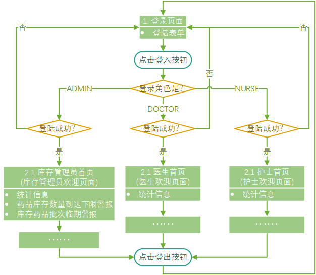  

##### 库存管理员页面流程图  

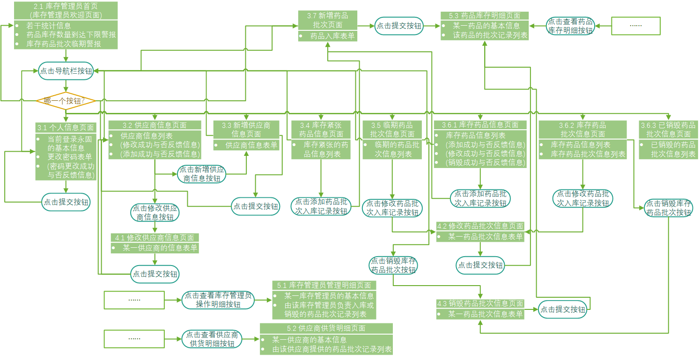  

##### 医生页面流程图  

  

##### 护士页面流程图  

  

参考：  

* [深入浅出为你解读四类「流程图」，附摩拜 / OFO 案例分析](http://www.chanpin100.com/article/105363)  
* [谈谈页面流程图 (附案例)](http://www.woshipm.com/pmd/27239.html)  

参考：  

* [UML 之时序图](https://www.cnblogs.com/gd-luojialin/p/10356740.html)  

### 环境准备  

#### 配置 Java 环境  

1. 下载 JDK 安装包：
   * [Java SE 官网](https://www.oracle.com/technetwork/java/javase/overview/index.html)  
   * [Java SE 官网下载页面](https://www.oracle.com/technetwork/java/javase/downloads/index.html)  
2. 配置环境变量：  

    | 变量 | 值 |
    | --- | --- |
    | JAVA_HOME | C:\Program Files\Java\jdk1.8.0_231 |
    | JRE_HOME | C:\Program Files\Java\jre1.8.0_231 |
    | Path | ;%JAVA_HOME%\bin |

#### 安装 Eclipse IDE for Enterprise Java Developers  

* [Eclipse 官网](https://www.eclipse.org/)  
* [Eclipse 官网 Installer 下载页面](https://www.eclipse.org/downloads/)  

#### 配置 Tomcat 环境  

1. 从官网下载相应的 Tomcat Binary Distributions 安装包文件 `32-bit/64-bit Windows Service Installer`。  
    * [Tomcat 官网](http://tomcat.apache.org/)  
    * [Tomcat 9 官网下载页面](https://tomcat.apache.org/download-90.cgi)  
2. 双击运行下载的安装文件，按照提示一步一步安装并配置。  
3. 配置环境变量：  

    | 变量 | 值 |
    | --- | --- |
    | TOMCAT_HOME | C:\Program Files\Apache Software Foundation\Tomcat 9.0 |
    | CATALINA_HOME | C:\Program Files\Apache Software Foundation\Tomcat 9.0 |
    | Path | ;%TOMCAT_HOME%\bin;%CATALINA_HOME%\lib |

#### 在 Eclipse 中配置 Tomcat Server  

参考：  

* [安装 Eclipse，配置 Tomcat](https://www.cnblogs.com/greenteaone/p/7929571.html)  
* [Eclipse 环境下如何配置 Tomcat，并且把项目部署到 Tomcat 服务器上](https://blog.csdn.net/weixin_41704733/article/details/79871950)  

### 创建一个新的 Dynamic Web 项目  

新建一个名为 `DIMS` 的 `Dynamic Web Project`，`Target runtime` 选择上一步在 Eclipse 当中配置的 `Apache Tomcat v9.0`，`Dynamic web module version` 选择最新版本，`Configuration` 选择 `Default Configuration for Apache Tomcat v9.0`，其它选项不作更改，点击 `Next`。  

将 `Default output folder` 的值改为 `WebContent\WEB-INF\classes`，点击 `Next`。  

勾选 `Generate web.xml deployment descriptor`，点击 `Finish`。  

测试项目是否可以发布成功，参考：  

* [Eclipse 环境下如何配置 Tomcat，并且把项目部署到 Tomcat 服务器上](https://blog.csdn.net/weixin_41704733/article/details/79871950)  

后续需要导入的 jar 包都复制到项目的 `WebContent\WEB-INF\lib` 目录当中来。  

### 集成 Spring 和 SpingMVC  

* [Spring 官网](https://spring.io/)  
* [Spring 发行版的下载地址](https://repo.spring.io/release/org/springframework/spring/)  
* [Spring 发行版 v5.2.1 的下载地址](https://repo.spring.io/release/org/springframework/spring/5.2.1.RELEASE/)  

下载 `spring-5.2.1.RELEASE-dist.zip` 并解压。  

#### 导入 Spring 的 jar 包  

将 `spring-5.2.1.RELEASE-dist.zip` 解压路径的 `libs` 目录下的一部分 jar 包复制到项目的 `WebContent\WEB-INF\lib` 目录当中来，需要的 jar 包如下：  

* spring-aop-5.2.1.RELEASE.jar  
* spring-aspects-5.2.1.RELEASE.jar  
* spring-beans-5.2.1.RELEASE.jar  
* spring-context-5.2.1.RELEASE.jar  
* spring-core-5.2.1.RELEASE.jar  
* spring-expression-5.2.1.RELEASE.jar  
* spring-jdbc-5.2.1.RELEASE.jar  
* spring-test-5.2.1.RELEASE.jar  
* spring-tx-5.2.1.RELEASE.jar  
* spring-web-5.2.1.RELEASE.jar  

#### 导入 SpringMVC 的 jar 包  

将 `spring-5.2.1.RELEASE-dist.zip` 解压路径的 `libs` 目录下的一部分 jar 包复制到项目的 `WebContent\WEB-INF\lib` 目录当中来，需要的 jar 包如下：  

* spring-webmvc-5.2.1.RELEASE.jar  

#### 导入 Apache Commons 的 jar 包  

* [Apache Commons 官网](https://commons.apache.org/index.html)  
* [Apache Commons 官网 jar 包下载地址](https://commons.apache.org/downloads/index.html)  

需要导入的 jar 包：  

* [commons-dbcp2-2.7.0.jar](https://commons.apache.org/proper/commons-dbcp/download_dbcp.cgi)  
* [commons-io-2.6.jar](https://commons.apache.org/proper/commons-io/download_io.cgi)  
* [commons-logging-1.2.jar](https://commons.apache.org/proper/commons-logging/download_logging.cgi)  
* [commons-pool2-2.7.0.jar](https://commons.apache.org/proper/commons-pool/download_pool.cgi)  

参考：  

* [一篇关于 Apache Commons 类库的详解](https://blog.csdn.net/wiker_yong/article/details/23551209)  
* [Apache Commons 工具包](https://blog.csdn.net/qq_34520606/article/details/78431802)  

#### 导入其它基础 jar 包  

* [aspectjweaver-1.9.4.jar](https://mvnrepository.com/artifact/org.aspectj/aspectjweaver)  
* [com.springsource.org.aopalliance-1.0.0.jar](https://mvnrepository.com/artifact/org.aopalliance/com.springsource.org.aopalliance)  
* [jackson-annotations-2.10.0.jar](https://mvnrepository.com/artifact/com.fasterxml.jackson.core/jackson-annotations)  
* [jackson-core-2.10.0.jar](https://mvnrepository.com/artifact/com.fasterxml.jackson.core/jackson-core)  
* [jackson-databind-2.10.0.jar](https://mvnrepository.com/artifact/com.fasterxml.jackson.core/jackson-databind)  

参考：  

* [com.springsource.*.xx.jar 和同名 *.xx.jar 有什么区别？](https://blog.csdn.net/snower08/article/details/83353064)  

#### 配置 Spring  

在项目的 `Java Resources` 项中新建一个名为 `resource` 的 'source folder'，然后在其下新建两个 XML 文件。  

applicationContext.xml：  

```xml
<?xml version="1.0" encoding="UTF-8"?>
<beans xmlns="http://www.springframework.org/schema/beans"
       xmlns:context="http://www.springframework.org/schema/context"
       xmlns:xsi="http://www.w3.org/2001/XMLSchema-instance"
       xsi:schemaLocation="http://www.springframework.org/schema/beans
                           http://www.springframework.org/schema/beans/spring-beans.xsd
                           http://www.springframework.org/schema/context
                           http://www.springframework.org/schema/context/spring-context.xsd">
</beans>
```

#### 配置 SpringMVC  

applicationContext-mvc.xml：  

```xml
<?xml version="1.0" encoding="UTF-8"?>
<beans xmlns="http://www.springframework.org/schema/beans"
       xmlns:mvc="http://www.springframework.org/schema/mvc"
       xmlns:context="http://www.springframework.org/schema/context"
       xmlns:xsi="http://www.w3.org/2001/XMLSchema-instance"
       xsi:schemaLocation="http://www.springframework.org/schema/beans
                           http://www.springframework.org/schema/beans/spring-beans.xsd
                           http://www.springframework.org/schema/context
                           http://www.springframework.org/schema/context/spring-context.xsd
                           http://www.springframework.org/schema/mvc
                           http://www.springframework.org/schema/mvc/spring-mvc.xsd">
    <!-- mvc 静态资源放行 —— 允许访问图片等静态资源 -->
    <mvc:default-servlet-handler/>
    
    <!-- mvc 支持注解 Controller -->
    <context:annotation-config/>
    <mvc:annotation-driven/>
    
    <!-- 设置扫描包的路径 Controller -->
    <context:component-scan base-package="com.dims.web.controller"/>
    
    <!-- 视图解析器 -->
    <bean class="org.springframework.web.servlet.view.InternalResourceViewResolver">
        <!-- 配置前缀和后缀 -->
        <property name="prefix">
            <value>/WEB-INF/views/</value>
        </property>
        <property name="suffix">
            <value>.jsp</value>
        </property>
    </bean>
</beans>
```

### 配置 web.xml  

在项目的 `WebContent\WEB-INF\` 目录下找到 web.xml 文件，进行配置：  

web.xml：  

```xml
<?xml version="1.0" encoding="UTF-8"?>
<web-app xmlns:xsi="http://www.w3.org/2001/XMLSchema-instance"
         xmlns="http://xmlns.jcp.org/xml/ns/javaee"
         xsi:schemaLocation="http://xmlns.jcp.org/xml/ns/javaee
                             http://xmlns.jcp.org/xml/ns/javaee/web-app_4_0.xsd"
         id="WebApp_ID" version="4.0">
    <display-name>DIMS</display-name>
    <welcome-file-list>
        <welcome-file>index.jsp</welcome-file>
    </welcome-file-list>
    
    <!-- 解决乱码问题 -->
    <filter>
        <filter-name>CharacterEncodingFilter</filter-name>
        <filter-class>org.springframework.web.filter.CharacterEncodingFilter</filter-class>
        <init-param>
            <param-name>encoding</param-name>
            <param-value>utf-8</param-value>
        </init-param>
    </filter>
    
    <filter-mapping>
        <filter-name>CharacterEncodingFilter</filter-name>
        <url-pattern>/*</url-pattern>
    </filter-mapping>
    
    <!-- 加载 spring 配置文件 -->
    <context-param>
        <param-name>contextConfigLocation</param-name>
        <param-value>classpath:applicationContext.xml</param-value>
    </context-param>
    
    <!-- 启动的时候加载 spring 的配置文件 -->
    <listener>
        <listener-class>org.springframework.web.context.ContextLoaderListener</listener-class>
    </listener>
    
    <!-- 启动的时候加载 springmvc 的配置文件 -->
    <servlet>
        <servlet-name>springmvc</servlet-name>
        <servlet-class>org.springframework.web.servlet.DispatcherServlet</servlet-class>
        <init-param>
            <param-name>contextConfigLocation</param-name>
            <param-value>classpath:applicationContext-mvc.xml</param-value>
        </init-param>
        <load-on-startup>1</load-on-startup>
    </servlet>
    
    <servlet-mapping>
        <servlet-name>springmvc</servlet-name>
        <url-pattern>/</url-pattern>
    </servlet-mapping>
</web-app>
```

### 集成 Spring 和 MyBatis  

#### 导入 MyBatis 的 jar 包  

* [MyBatis 官网](https://blog.mybatis.org/)  
* [MyBatis v3 官网](https://mybatis.org/mybatis-3/zh/index.html)  
* [MyBatis v3 GitHub 项目](https://github.com/mybatis/mybatis-3/)  
* [MyBatis-Spring 官网](http://mybatis.org/spring/zh/index.html)  

* [MyBatis v3 GitHub 项目 jar 包下载页面](https://github.com/mybatis/mybatis-3/releases)  
* [MyBatis-Spring jar 包下载页面](https://mvnrepository.com/artifact/org.mybatis/mybatis-spring/2.0.3)  

需要导入的 jar 包：  

* asm-7.0.jar  
* cglib-3.2.10.jar  
* javassist-3.24.1-GA.jar  
* log4j-1.2.17.jar  
* mybatis-3.5.3.jar  
* mybatis-spring-2.0.3.jar  
* slf4j-api-1.7.26.jar  
* slf4j-log4j12-1.7.26.jar  

除此之外还需要导入 SQL Server 的 JDBC Driver jar 包：  

* [mssql-jdbc-7.4.1.jre8.jar](https://docs.microsoft.com/en-us/sql/connect/jdbc/download-microsoft-jdbc-driver-for-sql-server?view=sql-server-ver15)  

#### 配置 MyBatis  

在 `resource` 目录下，新建一个名为 `jdbc.properties` 的文件：  

jdbc.properties：  

```
jdbc.driverClassName=com.microsoft.sqlserver.jdbc.SQLServerDriver
jdbc.url=jdbc:sqlserver://localhost:1433;databaseName=DIMS
jdbc.username=dba
jdbc.password=abcd1234@
```

在 Spring 的配置文件当中，配置 MyBatis：  

applicationContext.xml：  

```xml
<?xml version="1.0" encoding="UTF-8"?>
<beans xmlns="http://www.springframework.org/schema/beans"
       xmlns:context="http://www.springframework.org/schema/context"
       xmlns:xsi="http://www.w3.org/2001/XMLSchema-instance"
       xsi:schemaLocation="http://www.springframework.org/schema/beans
                           http://www.springframework.org/schema/beans/spring-beans.xsd
                           http://www.springframework.org/schema/context
                           http://www.springframework.org/schema/context/spring-context.xsd">
    <!-- jdbc.properties → dataSource → sqlSessionFactory → mapper → service → action -->
    
    <!-- jdbc.properties 加载 JDBC 配置文件 -->
    <context:property-placeholder location="classpath:jdbc.properties" />
    
    <!-- dataSource 配置数据源 (连接池) -->
    <bean id="dataSource" class="org.apache.commons.dbcp2.BasicDataSource" destroy-method="close">
        <!-- 依赖注入连接池需要的属性 -->
        <property name="driverClassName" value="${jdbc.driverClassName}" />
        <property name="url" value="${jdbc.url}" />
        <property name="username" value="${jdbc.username}" />
        <property name="password" value="${jdbc.password}" />
    </bean>
    
    <!-- sqlSessionFactory -->
    <bean id="sqlSessionFactory" class="org.mybatis.spring.SqlSessionFactoryBean">
        <!-- 引入数据源 -->
        <property name="dataSource" ref="dataSource" />
        <!-- 加载所有的 mapper 路径 -->
        <property name="mapperLocations" value="classpath:com/dims/mapper/*Mapper.xml" />
        <!-- 配置别名 -->
        <property name="typeAliasesPackage" value="com.dims.domain" />
    </bean>
    
    <!-- 扫描 mapper 层 -->
    <bean class="org.mybatis.spring.mapper.MapperScannerConfigurer">
        <!-- 扫描 mapper 接口的包路径 -->
        <property name="basePackage" value="com.dims.mapper" />
    </bean>
    
    <!-- 扫描 service 层 -->
    <context:component-scan base-package="com.dims.service" />
    
    <!-- action -->
</beans>
```

### 配置 log4j  

在 `resource` 目录下，新建一个名为 `log4j.properties` 的文件：  

log4j.properties：  

```
log4j.rootLogger=ERROR, stdout

log4j.logger.com.sms=TRACE

log4j.appender.stdout=org.apache.log4j.ConsoleAppender
log4j.appender.stdout.layout=org.apache.log4j.PatternLayout
log4j.appender.stdout.layout.ConversionPattern=%d %p [%c] - %m%n
```

### 集成基于 Bootstrap 前端框架的 ACE 管理系统页面模板  

* [ACE 管理系统页面模板预览](http://ace.jeka.by/)  
* [ACE GitHub 项目](https://github.com/bopoda/ace)  
* [ACE GitHub 项目 (中文版)](https://github.com/XinLiangCoder/AceAdmin)  

从 ACE 的 GitHub 项目页面下载该项目的压缩包，解压后将解压路径下的 `assets` 文件夹复制到项目的 `WebContent` 目录下。  

### 导入 Apache Taglibs 的 jar 包  

* [Apache Taglibs 官网下载页面](http://tomcat.apache.org/download-taglibs.cgi)  

需要导入的 jar 包：  

* taglibs-standard-impl-1.2.5.jar  
* taglibs-standard-spec-1.2.5.jar  

## 测试与验收  

### 界面测试  

界面测试：反复不间断地点击各窗体连接，测试其连接情况是否达到预期效果。  

发现的问题：  

1. 360 安全浏览器使用兼容模式时，部分链接无法正确处理。(极速模式可行)  

    客户端页面报错：  

    ```
    HTTP Status 400 - 错误的请求
    Type：异常报告
    消息：Invalid character found in the request target. The valid characters are defined in RFC 7230 and RFC 3986
    描述：由于被认为是客户端对错误 (例如：畸形的请求语法、无效的请求信息帧或者虚拟的请求路由)，服务器无法或不会处理当前请求。
    Exception：
    java.lang.IllegalArgumentException: Invalid character found in the request target. The valid characters are defined in RFC 7230 and RFC 3986
        at org.apache.coyote.http11.Http11InputBuffer.parseRequestLine(Http11InputBuffer.java:468)
        at org.apache.coyote.http11.Http11Processor.service(Http11Processor.java:292)
        at org.apache.coyote.AbstractProcessorLight.process(AbstractProcessorLight.java:66)
        at org.apache.coyote.AbstractProtocol$ConnectionHandler.process(AbstractProtocol.java:861)
        at org.apache.tomcat.util.net.NioEndpoint$SocketProcessor.doRun(NioEndpoint.java:1579)
        at org.apache.tomcat.util.net.SocketProcessorBase.run(SocketProcessorBase.java:49)
        at java.util.concurrent.ThreadPoolExecutor.runWorker(ThreadPoolExecutor.java:1149)
        at java.util.concurrent.ThreadPoolExecutor$Worker.run(ThreadPoolExecutor.java:624)
        at org.apache.tomcat.util.threads.TaskThread$WrappingRunnable.run(TaskThread.java:61)
        at java.lang.Thread.run(Thread.java:748)
    ```

    服务器端 Tomcat 报错：  

    ```
    十二月 22, 2019 3:28:49 下午 org.apache.coyote.http11.Http11Processor service
    信息: 解析 HTTP 请求 header 错误
    Note: further occurrences of HTTP request parsing errors will be logged at DEBUG level.
    java.lang.IllegalArgumentException: Invalid character found in the request target. The valid characters are defined in RFC 7230 and RFC 3986
        at org.apache.coyote.http11.Http11InputBuffer.parseRequestLine(Http11InputBuffer.java:468)
        at org.apache.coyote.http11.Http11Processor.service(Http11Processor.java:292)
        at org.apache.coyote.AbstractProcessorLight.process(AbstractProcessorLight.java:66)
        at org.apache.coyote.AbstractProtocol$ConnectionHandler.process(AbstractProtocol.java:861)
        at org.apache.tomcat.util.net.NioEndpoint$SocketProcessor.doRun(NioEndpoint.java:1579)
        at org.apache.tomcat.util.net.SocketProcessorBase.run(SocketProcessorBase.java:49)
        at java.util.concurrent.ThreadPoolExecutor.runWorker(ThreadPoolExecutor.java:1149)
        at java.util.concurrent.ThreadPoolExecutor$Worker.run(ThreadPoolExecutor.java:624)
        at org.apache.tomcat.util.threads.TaskThread$WrappingRunnable.run(TaskThread.java:61)
        at java.lang.Thread.run(Thread.java:748)
    ```

    解决方法：尚未解决。  

### 功能测试  

功能测试：对系统各功能模块逐一测试，尽最大可能地发现潜在 BUG 错误。  

发现的问题：  

1. 没有对处方表单当中的病人身份证号码输入栏作输入限制，该输入栏可以输入中文字符和特殊符号。  

    解决方法：在病人身份证号码的输入标签当中限制文本输入类型 (没有完全解决，仍然可以输入下划线 `_`)：  

    ```html
    <input ... onKeyUp="value=value.replace(/[\W]/g,'')" />
    ```

2. 在新增药品入库表单当中，药品数量输入栏的最小值输入限制设置为 0，而数量为 0 的药品批次没有意义。  

    解决方法：对于新增药品入库表单，限制药品数量输入标签的输入最小值为 1；对于修改药品入库表单，限制药品数量输入标签的输入最小值为 0。  

    ```javascript
    $('#spinner1').ace_spinner({value:${type ? '1' : '0'}, min:${type ? '1' : '0'}, max:10000, step:100, btn_up_class:'btn-info', btn_down_class:'btn-info'})
    .closest('.ace-spinner')
    .on('changed.fu.spinbox', function(){
        //console.log($('#spinner1').val())
    });
    ```

### 性能测试  

性能测试：将程序以局域网的形式连接数据库，查看数据连接是否满足多用户的要求。  

### 需求测试  

需求测试：根据需求分析的内容，给使用者进行试用，测试软件是否和当初设计的一样能满足各用户需求。  

发现的问题：  

1. 医生和发药处护士的若干需要查询处方列表的页面没有对查询结果进行初始化的排序。  

    解决方法：  

    原查询代码：  

    ```sql
    SELECT *
    FROM Prescription
    WHERE Dno = #{Dno};
    ```

    修改后的查询代码：  

    ```sql
    SELECT *
    FROM Prescription
    WHERE Dno = #{Dno}
    ORDER BY Ptime DESC;
    ```

## 遇到的问题  

1. `javax.el.PropertyNotFoundException: 类型[com.dims.domain.InventoryDrug]上找不到属性[Sno]`：  
    
    参考：  
    * [javax.el.PropertyNotFoundException——属性未找到](https://blog.csdn.net/gr_guhun/article/details/89953842)  

2. 关于 jsp 页面当中 Date / DateTime 类型的值的显示格式问题：  

    参考：  
    * [jsp 中的日期显示问题](https://blog.csdn.net/xiaolizi22233/article/details/54237183)  
    * [jstl 标签的 fmt:formatDate 格式化日期 String to Date](https://www.cnblogs.com/jxldjsn/p/6936924.html)  

3. 关于 jsp 页面当中实型值的显示格式问题：  

    参考：  
    * [jsp 页面的数显示两位小数](https://blog.csdn.net/guorun18/article/details/49616985)  

4. 关于 `Model Attribute` 和 `Session Attribute` 的作用域问题：  

    参考：  
    * []()  

5. SpringMVC 当中 Controller 层能不能有重载方法？  

    参考：  
    * [SpringMVC 里面 Controller 能不能重载方法](https://blog.csdn.net/qq_38366063/article/details/93030217)  

6. 怎么把聚合函数 `SUM` 的 `NULL` 聚合结果值改为 `0`？  

    参考：  
    * [SQL Server 聚合函数 SUM 计算出来为空，怎样返回 0](https://blog.csdn.net/weixin_30740295/article/details/97448163)  

7. MyBatis Mapper 层的 XML 映射文件报错 `The content of elements must consist of well-formed character data or markup.`：  

    参考：  
    * [MyBatis 报 The content of elements must consist of well-formed character data or markup. 语法格式错误](https://www.cnblogs.com/wangjinyu/p/10100550.html)  
    * [MyBatis 异常：The content of elements must consist of well-formed character data or markup. 的解决方法](https://blog.csdn.net/qq_37856300/article/details/85296159)  

8. 怎么把 SQL Server `GETDATE()` 函数返回的 `DATETIME` 类型的值转换为 `DATE` 类型的值？  

    参考：  
    * [SQL Server GETDATE() 函数](https://www.w3school.com.cn/sql/func_getdate.asp)  
    * [SQL Server 获取当前日期](https://www.cnblogs.com/Scholars/p/8919094.html)  
    * [SQL Server 中将 DATETIME 类型转换为 DATE，或者 TIME](https://blog.csdn.net/diligentcatrich/article/details/6274126)  
    * [SQL Server DATETIME 数据类型的格式转换](https://www.cnblogs.com/fubeidong/archive/2007/07/06/526247.html)  

9. 在 SQL Server 当中怎么计算时间差？  

    参考：  
    * [SQL Server DATEDIFF() 函数](https://www.w3school.com.cn/sql/func_datediff.asp)  

10. 怎样进行内网穿透，让外网能访问本地的应用？  

    参考：  
    * [花生壳官网](https://hsk.oray.com/)  
    * [一分钟实现内网穿透 (ngrok 服务器搭建)](https://blog.csdn.net/zhangguo5/article/details/77848658)  
    * [内网穿透神器——Serveo](https://www.jianshu.com/p/d0b3991a9ce1)  
    * [内网穿透工具的原理与开发实战](https://zhuanlan.zhihu.com/p/30351943)  

11. Java 如何对枚举类型的变量进行赋值？  

    参考：  
    * [Java 枚举类型的使用](https://www.cnblogs.com/Jesuslovesme/p/8982595.html)  

12. Java 如何对 Date 类型的变量进行赋值？  

    参考：  
    * [Java 实现日期 Date 的赋值](https://blog.csdn.net/qq_42928918/article/details/89324295)  

13. URL 中参数带空格应该如何表示？  

    参考：  
    * [URL 参数中有 +、空格、=、%、&、# 等特殊符号的问题解决](https://www.cnblogs.com/jphoebe/p/6437185.html)  

14. 关于 Java 的重写 (Override) 与重载 (Overload):  

    参考：  
    * [Java 重写 (Override) 与重载 (Overload)](https://www.runoob.com/java/java-override-overload.html)  

15. MyBatis 的 Mapper 层接口方法可以重载吗？  

    参考：  
    * [MyBatis 中的 dao 层接口是否可以重载？](https://www.cnblogs.com/wgyi140724-/p/10736575.html)   
    * [MyBatis 注解方法不能重载](https://blog.csdn.net/unix21/article/details/52239514)  
    
    有空再看：  
    * [MyBatis 接口重载：使用 JDK 1.8 default 关键字解决 MyBatis 方法不支持重载问题](https://blog.csdn.net/qq_28898917/article/details/103567919)  

16. MyBatis 如何调用存储过程？  

    参考：  
    * [MyBatis 示例之存储过程](https://www.cnblogs.com/wojiaochuichui/p/8568208.html)  
    * [MyBatis 调用存储过程](http://www.luyixian.cn/news_show_5471.aspx)  
    * [MyBatis 调用存储过程获得取返回值](https://www.cnblogs.com/yanan7890/p/8776379.html)  

17. SQL Server 事务的使用是为了确保数据的一致性，但是当操作 (增删改) 发生由 NULL 值引发的错误时，事务会跳过错误继续执行正常的语句，如何让该种事务回滚？  

    参考：  
    * [SQL Server 事务的使用 (tran)](https://www.cnblogs.com/itsone/p/10273317.html)  

18. MyBatis insert Mapper 如何获取自增主键值？  

    参考：  
    * [Mybatis 获取自增主键值 (Mysql、Oracle)](https://blog.csdn.net/yamadeee/article/details/83997122)  

19. SQL Server 怎么查询所有登录用户？  

    参考：  
    * [SQL Query for Logins](https://stackoverflow.com/questions/37275/sql-query-for-logins)  
20. HTML 表单隐藏域怎么实现？  

    参考：  
    * [HTML 表单隐藏域](https://blog.csdn.net/qq_36260974/article/details/88370624)  

22. SQL Server 游标的使用？  

    参考：  
    * [SQL Server 简单游标使用](https://blog.csdn.net/duqiang741/article/details/80851827)  
    * [SQL Server 中的循环遍历 (普通循环和游标循环)](https://blog.csdn.net/weixin_42026802/article/details/80575689)  

23. SQL Server 定义游标时的子查询不能使用 ORDER BY 语句？  

    参考：  
    * [游标读取的 SELECT 语句不能用 ORDER BY 排序，怎么办？](https://bbs.csdn.net/topics/391931688)  
    * [SQL Server 里的游标里使用 ORDER BY 语句](https://blog.csdn.net/Pagegle/article/details/84587608)  
    * [SQL Server 里的游标，它的数据集里写的 SELECT 语句可以用 ORDER BY 吗？](https://bbs.csdn.net/topics/390958749)  

24. HTML 如何限制 input 输入栏的文本输入？  

    参考：  
    * [HTML 限制文本框输入类型](https://www.jianshu.com/p/4e1e7c765512)  

## 成果截图  

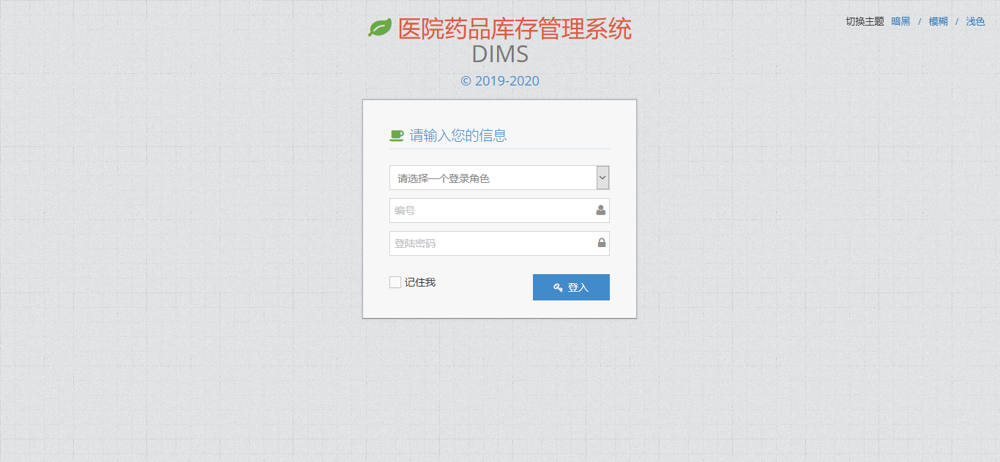  

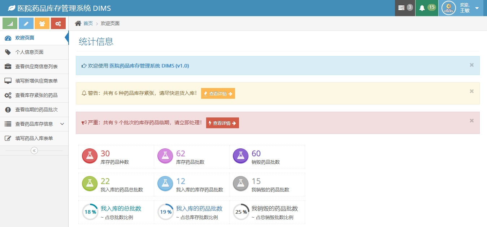  

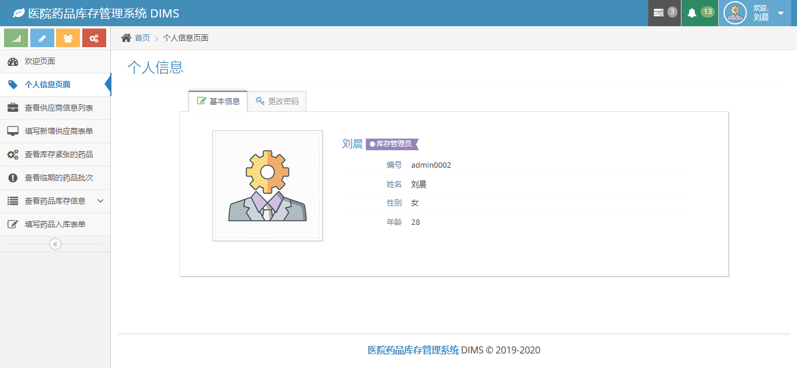  

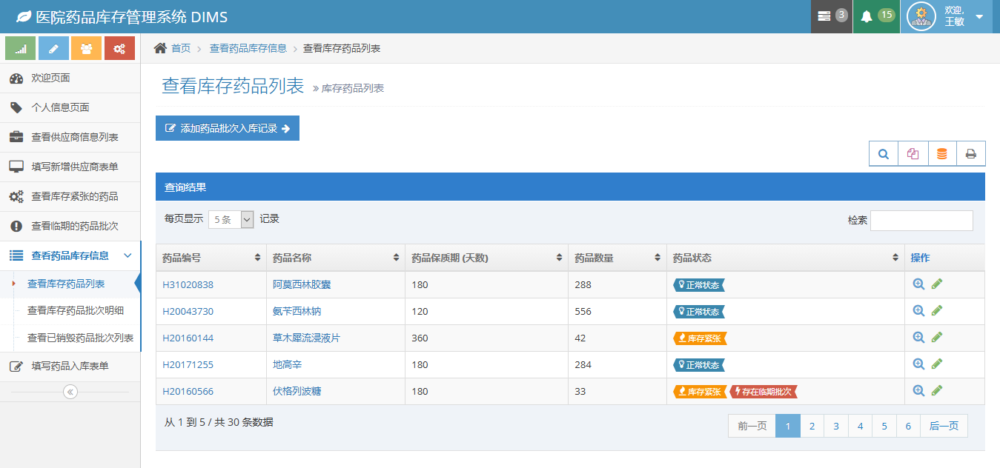  

  

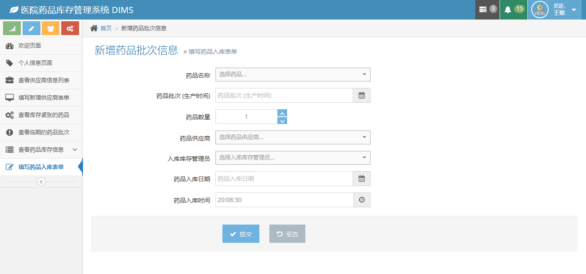  

  
